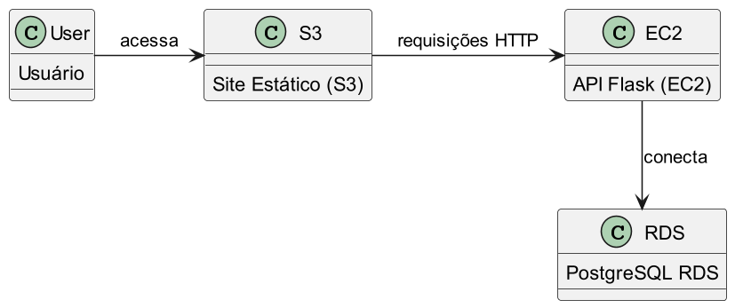

# Architecture Overview

**Descrição:**

1. O usuário acessa o site estático hospedado no Amazon S3.
2. O site faz requisições HTTP para a API desenvolvida em Flask, que está rodando em uma instância EC2.
3. A API Flask se conecta ao banco de dados PostgreSQL hospedado no Amazon RDS para armazenar e recuperar dados.

**Descrição:**

1. O usuário acessa o site estático hospedado no Amazon S3.
2. O site faz requisições HTTP para a API desenvolvida em Flask, que está rodando em uma instância EC2.
3. A API Flask se conecta ao banco de dados PostgreSQL hospedado no Amazon RDS para armazenar e recuperar dados.
