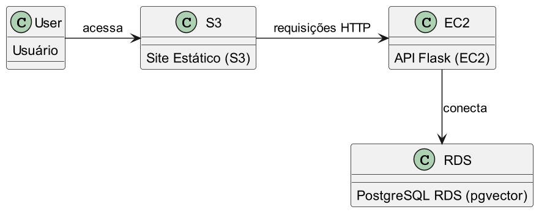

# Nível 1: Hardware e Infraestrutura

Neste nível, a plataforma de IA é construída sobre recursos básicos da nuvem, como EC2, S3 e RDS. O time é responsável por toda a configuração, integração e operação dos componentes.

- **Exemplo:** API Flask em EC2, armazenamento de arquivos no S3, banco de dados vetorial no RDS Postgres/pgvector.
- **Diagrama:**

Ideal para times que precisam de controle total e customização, mas exige maior esforço operacional.
