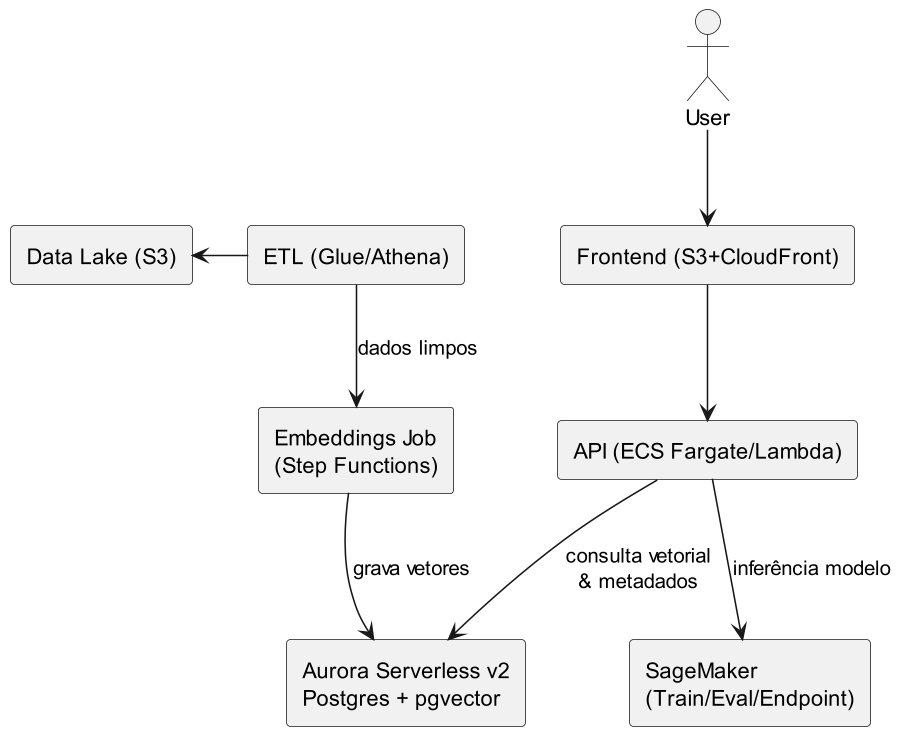

# Nível 2: Modelos e Serviços de ML Gerenciados

Neste nível, a empresa utiliza serviços como Amazon SageMaker para treinar, hospedar e operacionalizar modelos de machine learning, reduzindo a complexidade de infraestrutura.

- **Exemplo:** Treinamento e deploy de modelos no SageMaker, pipelines de ML gerenciados.
- **Diagrama:**

Permite maior foco em experimentação e resultados, com menos preocupação operacional.
