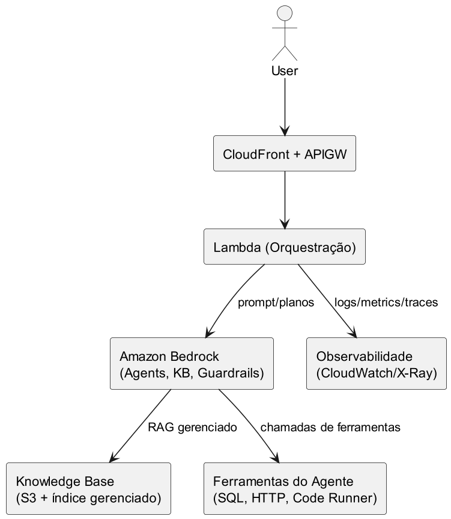

# Nível 3: Aplicações e Serviços de IA

O estágio mais avançado, onde a empresa utiliza serviços de IA prontos (Amazon Bedrock, AWS AI Services, modelos fundamentais, agentes, etc.) e foca em construir aplicações inteligentes, serverless e altamente integradas.

- **Exemplo:** Aplicações que consomem modelos via API, agentes, RAG, ferramentas serverless.
- **Diagrama:**

Permite máxima agilidade e inovação, com baixa complexidade operacional.
